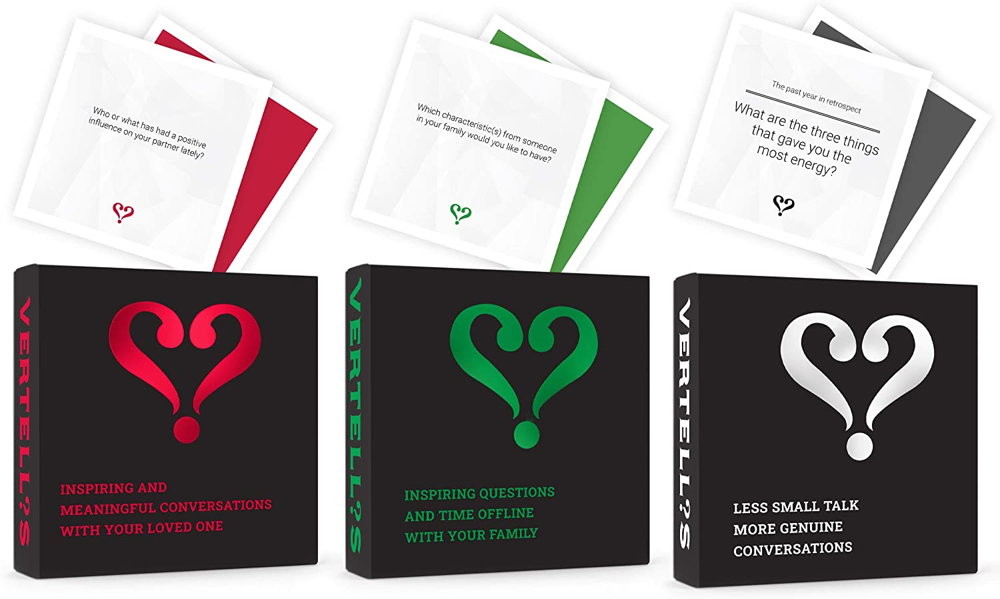
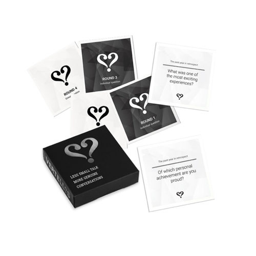
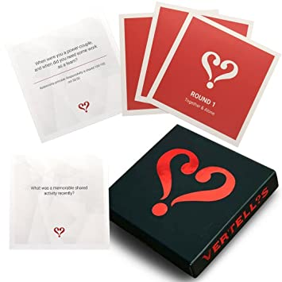

# Vertellis App 
[Vertellis](https://vertellis.com/) is a conversation starter card game with a focus on encouraging less small talk and more genuine conversation between friends, couples and families to encourage a deep sense of connection. 

[The Vertellis company](https://www.starterstory.com/businesses/vertellis.com), founded in 2020, is a Dutch eCommerce books & games business based in Amsterdam. The word 'Vertellis' means 'tell me more' in Dutch.

There are different game packages for different target audiences and different occasions: family and friends, romantic relationships and a holiday edition. 
The game consists of cards in various subject categories with questions that have been developed by psychologists, teachers and relationship therapists. Each player takes a card and answers the question written on it in front of the group. The intention is to spark meaningful conversation and allow participants to get to know each other on a more personal level. Some questions also invite reflection upon the relationships between participants.  

### Why build an app? :earth_asia:
As an avid fan of Vertellis games, I appreciate that one of the company's stated missions is to *'stimulate time offline'*. However, I have found myself wishing I had a compact and portable version of Vertellis on several occassions when there is time and willingness for a conversation, but not necessarily a desire to sit down with physical cards. For example, whilst on a family walk in nature or when travelling light and not wanting to carry a pack of cards, or even when the desire to play comes up spontaneously, on-the-go. Many times I wished I had a Vertellis app on my phone, which sparked the idea for this project. 

I belive that Vertellis is not only a game, but a mindful practice akin to meditation. It can be a powerful tool for strengthening and mending relationships, which in turn results in better mental health for all. Making Vertellis more affordable and accessible aligns with the company's mission statement to bring people all over the world closer together. 

#### New features :thought_balloon: :bulb:
Another added value of creating a Vertellis app is the addition of features that are not always possible in the physical edition of the game. Some intial ideas include:

* **Timed games:** sometimes, a user might have a specific window of time they want to dedicate to the game. In the app, they could set up their game based on a time limit and the app will serve the appropriate amount of cards for that time frame, including a timer that runs in the background and lets the user know when the game is finished. 
* **Level of conversation:** the app can serve a different set of cards based on the user's desired depth of conversation. Some times 'lighter' topics will be more appropriate, and other times a more serious, emotional conversation might be in order. This can vary based on the user's mood, who they are playing with and how much time they have available to them. 
* **Takeaways:** users can make note and log their takeaways, lessons learned and future goals based on insights gaiend from each game.
* **Accountability:** users can create an account and view their game history, including past games, takeaways and goals. Users can set up future games or commit to a weekly/monthly practice and share it with others for greater accountability. 

#### Business growth :seedling:
From a marketing perspective, the Vertellis app can be used as a tool to:

* Expand reach to new audiences globally
* Build an even more dedicated consumer audience with a stronger connection to the Vertellis brand
* Drive sales of other existing Vertellis products such as [The Vertellis Mindset Method](https://join.vertellis.com/vertellis-mindset/) 12-month online program
* The app has growth potential to become an overall mental wellbeing app, allowing users to log their personal mental health - a condensed version of journaling.  

### User stories :clipboard:
* I can start a game by specifiyng how long I want to play for (15, 30, 50 minutes or 'no timer')
* I can specifiy the depth and tone of the conversation I want to have ('casual', 'delve deep' or 'wildcard')
* I can share my game with the other player/s so that they can access it on their device.
* I hear a (soothing) sound that gently let's me know I should move on to the next card
* I can disable the sound notification if I don't wish to keep time
* I can swipe right to see the next card.
* I can swipe left to view the previous card.
* At the end of the game, I see a summary screen that prompts me to put in my takeaways and lessons learned from each particulare game
* I can set up a future game with a specific date and time and invite players
* I can add the future game to my digital calendar with a click
* I can allow notifications to notify me when it is time to play
* I can set up a user account
* I can see my game history and revisit past games and their takeaways
* I can set up a weekly/monthly commitment to play and allow the app to prompt me to play / set up a future game

### Visuals
The user interface will be designed based on the current look of the physical card game. See examples: 

